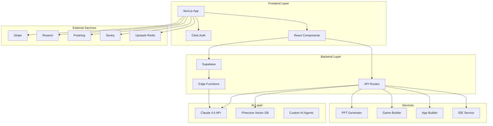

Here's a comprehensive README for your **Unicode** platform. I've designed it to showcase all your features including the PPT generator, AI app builder, game builder, and the complete CS education ecosystem.

```markdown
# 🚀 Unicode - The All-in-One Computer Science Education Platform

<div align="center">


**From "Hello World" to "Software Engineer" - Your AI-Powered Co-pilot for Computer Science Education**

[](https://nextjs.org/)
[](https://www.typescriptlang.org/)
[](https://supabase.com/)
[](https://vercel.com/)
[](https://www.anthropic.com/claude)

[](https://opensource.org/licenses/MIT)
[](http://makeapullrequest.com)
[](https://vercel.com)

</div>

## 📖 Table of Contents

- [🎯 Vision](#-vision)
- [✨ Features](#-features)
- [🏗️ Architecture](#️-architecture)
- [🚀 Quick Start](#-quick-start)
- [📚 Core Features Deep Dive](#-core-features-deep-dive)
  - [🤖 AI App Builder](#-ai-app-builder)
  - [🎮 AI Game Builder](#-ai-game-builder)
  - [📊 AI Presentation Generator](#-ai-presentation-generator)
  - [💻 In-Browser IDE](#-in-browser-ide)
  - [🔒 Cybersecurity Sandbox](#-cybersecurity-sandbox)
  - [📝 Linux Terminal Simulator](#-linux-terminal-simulator)
- [🛠️ Tech Stack](#️-tech-stack)
- [📦 Installation](#-installation)
- [🔧 Configuration](#-configuration)
- [🌐 Deployment](#-deployment)
- [📊 Analytics & Monitoring](#-analytics--monitoring)
- [🤝 Contributing](#-contributing)
- [📄 License](#-license)
- [🙏 Acknowledgments](#-acknowledgments)

## 🎯 Vision

**Unicode** is more than just another learning platform. It's a revolutionary ecosystem designed to bridge the gap between CS education and real-world software engineering. 

Most students enter Computer Science with dreams of building amazing things, but many hit a wall when faced with:
- Complex Linux terminals
- Multiple programming languages
- Software architecture documentation
- Cybersecurity concepts
- Professional development workflows

**Unicode eliminates these barriers by providing an AI-powered co-pilot that guides students through every step of their journey.**

## ✨ Features

### 🤖 AI App Builder
Generate full-stack applications from natural language descriptions. Describe what you want to build, and Unicode creates:
- Complete React/Next.js components
- Database schemas
- API endpoints
- Authentication flows
- Styling and animations

### 🎮 AI Game Builder
Create playable games with simple prompts:
- 2D platformers
- RPG adventures
- Puzzle games
- Multiplayer experiences
- Interactive stories

### 📊 AI Presentation Generator
Transform ideas into professional presentations:
- Academic lecture slides
- Project proposals
- Technical documentation
- Research presentations
- Multi-language support (EN, ZH, ES, JA)

### 💻 In-Browser IDE
Write, compile, and execute code directly in your browser:
- Support for 20+ programming languages
- Real-time collaboration
- Code debugging tools
- Version control integration
- AI-powered code completion

### 🔒 Cybersecurity Sandbox
Learn ethical hacking in a safe environment:
- Penetration testing labs
- Vulnerability assessments
- Network security simulations
- CTF challenges
- Real-time threat analysis

### 📝 Linux Terminal Simulator
Master the command line without fear:
- Interactive Linux environment
- File system navigation
- Bash scripting
- Process management
- Permission handling

## 🏗️ Architecture



## 🚀 Quick Start

### Prerequisites

- Node.js 18+ 
- npm/yarn/pnpm
- Supabase account
- Anthropic API key (Claude 4.6)
- Git

### Installation

```bash
# Clone the repository
git clone https://github.com/yourusername/unicode.git
cd unicode

# Install dependencies
npm install

# Copy environment variables
cp .env.example .env.local

# Set up Supabase
npx supabase init
npx supabase start

# Run database migrations
npx supabase db push

# Start the development server
npm run dev
```

Your application will be running at `http://localhost:3000`

## 📚 Core Features Deep Dive

### 🤖 AI App Builder

Generate complete applications from natural language prompts.

```typescript
// Example: Build a todo app
const app = await unicode.buildApp({
  prompt: "Create a task management app with user authentication, drag-and-drop task organization, and due date reminders",
  stack: "nextjs-tailwind-postgres",
  features: ["auth", "realtime", "notifications"]
});

// Output: Complete Next.js app with:
// - Authentication (Clerk)
// - Database schema (Supabase)
// - UI components (shadcn/ui)
// - API routes
// - Real-time updates
```

**Key Features:**
- 🎨 Automatic UI generation
- 📊 Database schema design
- 🔐 Authentication integration
- 🚀 One-click deployment
- 🔄 Real-time updates

### 🎮 AI Game Builder

Create engaging games with simple descriptions.

```typescript
const game = await unicode.buildGame({
  genre: "platformer",
  theme: "cyberpunk",
  mechanics: ["double-jump", "dash", "power-ups"],
  levels: 5,
  multiplayer: false
});

// Generates:
// - Game engine (Phaser/Three.js)
// - Level designs
// - Character sprites
// - Sound effects
// - Game logic
```

**Supported Genres:**
- Platformers
- RPGs
- Puzzle games
- Endless runners
- Strategy games
- Card games

### 📊 AI Presentation Generator

Transform ideas into professional slides.

```tsx
import { PPTGenerator } from '@/components/ppt/PPTGenerator';

<PPTGenerator 
  courseContext={{
    courseId: 'cs101',
    courseName: 'Data Structures'
  }}
  onGenerate={(url) => console.log('Presentation ready:', url)}
/>
```

**Features:**
- 🎨 Multiple templates (business, academic, technical)
- 🌐 Multi-language support
- 📊 Automatic chart generation
- 💻 Code syntax highlighting
- 🖼️ Smart image suggestions
- 📧 Email delivery

### 💻 In-Browser IDE

Professional development environment in your browser.

```typescript
// Initialize IDE
const ide = await unicode.initIDE({
  language: "python",
  template: "data-science",
  packages: ["numpy", "pandas", "matplotlib"],
  ai_assistant: true
});

// Features:
// - Real-time code execution
// - AI-powered debugging
// - Version control
// - Collaborative editing
// - Terminal access
```

**Supported Languages:**
Python, JavaScript, TypeScript, Java, C++, C#, Go, Rust, Ruby, PHP, Swift, Kotlin, and more!

### 🔒 Cybersecurity Sandbox

Learn security in a controlled environment.

```bash
# Start a security lab
unicode security start-lab --type="web-security" --difficulty="intermediate"

# Available labs:
# - SQL Injection playground
# - XSS challenge arena
# - Network penetration testing
# - Cryptography workshop
# - Reverse engineering lab
```

### 📝 Linux Terminal Simulator

Master Linux without installing anything.

```bash
# Start terminal session
unicode terminal start --distro="ubuntu" --level="beginner"

# Guided lessons:
# - File system navigation
# - Permission management
# - Process control
# - Bash scripting
# - System administration
```

## 🛠️ Tech Stack

### Frontend
- **Framework:** Next.js 15 (App Router)
- **Language:** TypeScript 5.0
- **Styling:** Tailwind CSS + shadcn/ui
- **State Management:** Zustand + TanStack Query
- **Animations:** Framer Motion

### Backend
- **Database:** Supabase (PostgreSQL)
- **Authentication:** Clerk
- **File Storage:** Supabase Storage
- **Real-time:** Supabase Realtime
- **Edge Functions:** Vercel Edge + Supabase Edge

### AI & Machine Learning
- **LLM:** Anthropic Claude 4.6
- **Vector Database:** Pinecone
- **Embeddings:** Claude Embeddings
- **AI Agents:** Custom ReAct agents

### DevOps & Hosting
- **Hosting:** Vercel
- **Domain:** Namecheap
- **DNS:** Cloudflare
- **CDN:** Vercel Edge Network

### Payments & Communications
- **Payments:** Stripe
- **Emails:** Resend
- **Background Jobs:** Upstash Redis + Queue

### Monitoring & Analytics
- **Analytics:** PostHog
- **Error Tracking:** Sentry
- **Performance:** Vercel Analytics
- **Logging:** Supabase Logs

### Development Tools
- **Version Control:** GitHub
- **CI/CD:** Vercel GitHub Integration
- **Code Quality:** ESLint + Prettier
- **Testing:** Jest + React Testing Library

## 📦 Installation

### Step 1: Clone and Install Dependencies

```bash
git clone https://github.com/yourusername/unicode.git
cd unicode
npm install
```

### Step 2: Set Up Environment Variables

Create `.env.local`:

```env
# Supabase
NEXT_PUBLIC_SUPABASE_URL=your_supabase_url
NEXT_PUBLIC_SUPABASE_ANON_KEY=your_anon_key
SUPABASE_SERVICE_ROLE_KEY=your_service_key

# Anthropic Claude
ANTHROPIC_API_KEY=your_anthropic_key

# Clerk Authentication
NEXT_PUBLIC_CLERK_PUBLISHABLE_KEY=your_clerk_key
CLERK_SECRET_KEY=your_clerk_secret
CLERK_WEBHOOK_SECRET=your_webhook_secret

# Stripe Payments
STRIPE_SECRET_KEY=your_stripe_key
STRIPE_WEBHOOK_SECRET=your_stripe_webhook
NEXT_PUBLIC_STRIPE_PUBLISHABLE_KEY=your_stripe_publishable

# Resend Email
RESEND_API_KEY=your_resend_key

# PostHog Analytics
NEXT_PUBLIC_POSTHOG_KEY=your_posthog_key

# Sentry Error Tracking
SENTRY_DSN=your_sentry_dsn

# Upstash Redis
UPSTASH_REDIS_URL=your_upstash_url
UPSTASH_REDIS_TOKEN=your_upstash_token

# Pinecone Vector DB
PINECONE_API_KEY=your_pinecone_key
PINECONE_ENVIRONMENT=your_pinecone_env
PINECONE_INDEX=unicode_index

# Vercel (optional)
VERCEL_TOKEN=your_vercel_token
```

### Step 3: Database Setup

```bash
# Start Supabase locally
npx supabase start

# Run migrations
npx supabase db push

# Seed database
npm run seed

# Open Studio
npx supabase studio
```

### Step 4: Run Development Server

```bash
npm run dev
```

Open [http://localhost:3000](http://localhost:3000)

## 🔧 Configuration

### Supabase Configuration

```sql
-- Enable necessary extensions
CREATE EXTENSION IF NOT EXISTS vector;
CREATE EXTENSION IF NOT EXISTS pgcrypto;

-- Set up storage buckets
INSERT INTO storage.buckets (id, name) VALUES 
  ('ppt-templates', 'ppt-templates'),
  ('generated-ppts', 'generated-ppts'),
  ('game-assets', 'game-assets'),
  ('code-projects', 'code-projects');

-- Set up Row Level Security (RLS)
ALTER TABLE users ENABLE ROW LEVEL SECURITY;
ALTER TABLE courses ENABLE ROW LEVEL SECURITY;
ALTER TABLE projects ENABLE ROW LEVEL SECURITY;
```

### Clerk Configuration

1. Go to [Clerk Dashboard](https://dashboard.clerk.com)
2. Create new application
3. Configure social logins (Google, GitHub)
4. Set up webhook endpoints
5. Add to `.env.local`

### Stripe Configuration

```bash
# Set up products in Stripe Dashboard
Product 1: Unicode Basic - $9.99/month
- 10 AI generations/month
- Basic IDE features
- Community support

Product 2: Unicode Pro - $29.99/month
- Unlimited AI generations
- Advanced IDE features
- Priority support
- Team collaboration

Product 3: Unicode Enterprise - Custom pricing
- Everything in Pro
- Custom AI models
- On-premise deployment
- 24/7 dedicated support
```

## 🌐 Deployment

### Deploy to Vercel

```bash
# Install Vercel CLI
npm i -g vercel

# Deploy
vercel

# Set environment variables
vercel env pull
vercel env add ANTHROPIC_API_KEY
vercel env add SUPABASE_SERVICE_ROLE_KEY

# Deploy to production
vercel --prod
```

### Deploy Edge Functions

```bash
# Deploy Supabase Edge Functions
supabase functions deploy manage-templates
supabase functions deploy process-payments
supabase functions deploy generate-game-assets
```

### Domain Configuration (Namecheap + Cloudflare)

1. **Add site to Cloudflare**
2. **Update nameservers in Namecheap**
3. **Configure DNS records:**
   ```
   Type: A, Name: @, Value: 76.76.21.21 (Vercel IP)
   Type: CNAME, Name: www, Value: cname.vercel-dns.com
   ```
4. **Add domain in Vercel dashboard**

## 📊 Analytics & Monitoring

### PostHog Events Tracking

```typescript
// Track feature usage
posthog.capture('feature_used', {
  feature: 'ppt_generator',
  template_type: 'business',
  generation_time: 2.5
});

// Track user journey
posthog.capture('course_completed', {
  course_id: 'cs101',
  time_to_complete: '2_weeks',
  grade: 'A'
});
```

### Sentry Error Monitoring

```typescript
// Custom error tracking
Sentry.captureException(error, {
  tags: {
    feature: 'game_builder',
    user_id: userId
  },
  extra: {
    prompt: userPrompt,
    model: 'claude-4.6'
  }
});
```

## 🤝 Contributing

We welcome contributions! See our [Contributing Guide](CONTRIBUTING.md).

### Development Workflow

```bash
# Fork the repository
# Create feature branch
git checkout -b feature/amazing-feature

# Make changes
npm run dev

# Run tests
npm run test

# Build for production
npm run build

# Commit changes
git commit -m 'Add amazing feature'

# Push to branch
git push origin feature/amazing-feature

# Open Pull Request
```

### Code Style

- Use TypeScript strictly
- Follow Next.js App Router conventions
- Write comprehensive tests
- Document complex logic
- Use conventional commits

## 📄 License

This project is licensed under the MIT License - see the [LICENSE](LICENSE) file for details.

## 🙏 Acknowledgments

- **Anthropic** for Claude 4.6 API
- **Supabase** for amazing backend infrastructure
- **Vercel** for seamless deployment
- **Clerk** for authentication
- **Open Source Community** for countless tools and libraries

## 📞 Contact & Support

- **Website:** [https://unicode.dev](https://unicode.dev)
- **Documentation:** [https://docs.unicode.dev](https://docs.unicode.dev)
- **instagram:** cheesenutman
## 🗺️ Roadmap

### Q2 2025
- ✅ AI App Builder (Beta)
- ✅ AI Game Builder (Beta)
- ✅ Presentation Generator
- ✅ In-Browser IDE

### Q3 2025
- 🔄 Mobile app (iOS/Android)
- 🔄 Offline mode
- 🔄 More game templates
- 🔄 Custom AI model fine-tuning

### Q4 2025
- 📅 Enterprise features
- 📅 White-label solutions
- 📅 AI code review
- 📅 Team collaboration tools

### 2026
- 🎯 AR/VR integration
- 🎯 Blockchain development
- 🎯 Quantum computing basics
- 🎯 AI-powered career coaching

---

<div align="center">

**Built with ❤️ for CS students worldwide**

[Report Bug](https://github.com/yourusername/unicode/issues) · [Request Feature](https://github.com/yourusername/unicode/issues) · [Star on GitHub](https://github.com/yourusername/unicode)

</div>
```

## Additional Files for GitHub

### CONTRIBUTING.md

```markdown
# Contributing to Unicode

We love your input! We want to make contributing to Unicode as easy and transparent as possible.

## Development Process

1. Fork the repo
2. Create your feature branch (`git checkout -b feature/amazing`)
3. Commit your changes (`git commit -m 'Add amazing feature'`)
4. Push to branch (`git push origin feature/amazing`)
5. Open a Pull Request

## Pull Request Process

1. Update the README.md with details of changes
2. Update the docs with any new environment variables
3. The PR will be merged once you have the sign-off of maintainers

## Code Style

- Use TypeScript
- Follow Next.js conventions
- Add tests for new features
- Document complex logic

## License

By contributing, you agree that your contributions will be licensed under MIT License.
```

### LICENSE

```markdown
MIT License

Copyright (c) 2025 Unicode

Permission is hereby granted, free of charge, to any person obtaining a copy
of this software and associated documentation files...

[Full MIT License text]
```

### .github/workflows/ci.yml

```yaml
name: CI/CD

on:
  push:
    branches: [main]
  pull_request:
    branches: [main]

jobs:
  test:
    runs-on: ubuntu-latest
    steps:
      - uses: actions/checkout@v3
      - uses: actions/setup-node@v3
      - run: npm ci
      - run: npm run test
      - run: npm run lint
      - run: npm run type-check

  deploy:
    needs: test
    runs-on: ubuntu-latest
    if: github.ref == 'refs/heads/main'
    steps:
      - uses: actions/checkout@v3
      - uses: amondnet/vercel-action@v20
        with:
          vercel-token: ${{ secrets.VERCEL_TOKEN }}
          vercel-org-id: ${{ secrets.ORG_ID}}
          vercel-project-id: ${{ secrets.PROJECT_ID}}
```


Ready to push to GitHub! 🚀
